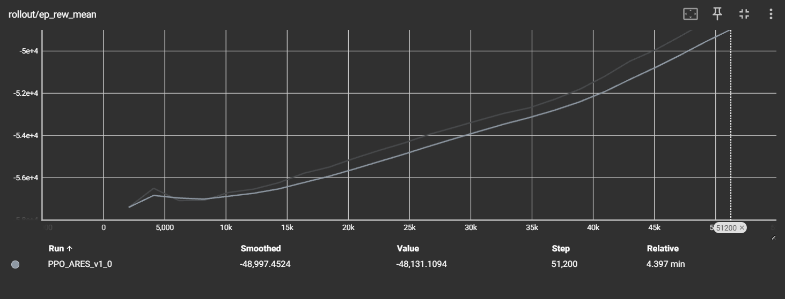

# ARES: Autonomous Resilience & Efficiency for Supply-chains
### A Digital Twin & Deep Reinforcement Learning-Powered Optimization Engine


_**Figure 1:** The agent's average reward per episode (a proxy for operational efficiency) steadily increased over 50,000 training steps, demonstrating successful learning._

---

## 🚀 The Problem: Fragile Supply Chains are a Multi-Trillion Dollar Risk

Global supply chains are the backbone of modern commerce, but they are incredibly brittle. A single factory fire, port closure, or geopolitical event can trigger cascading failures, leading to billions in lost revenue and crippling product shortages. Traditional logistics management is reactive, relying on static rules or human planners who cannot compute optimal strategies during a crisis.

This project tackles a critical business question: **Can we train an AI to autonomously manage a supply chain more effectively than a human-defined heuristic?**

## 💡 The Solution: A Self-Learning Digital Brain

ARES is a Python-based simulation environment (a "Digital Twin") that models a complex global supply chain. It creates a risk-free sandbox where a **Proximal Policy Optimization (PPO)** agent is trained to act as an autonomous global logistics manager.

The DRL agent learns, through tens of thousands of simulated scenarios, how to make optimal decisions to **minimize costs and delivery times** while **proactively routing around disruptions**.

### Key Features:
*   **Dynamic Digital Twin:** Built with **SimPy**, the simulation models key components like factories, warehouses, shipping routes, and randomly fluctuating market demands.
*   **Intelligent DRL Agent:** A PPO agent, implemented with **Stable-Baselines3**, learns sophisticated, dynamic logistics strategies that go beyond simple rules.
*   **AI-Friendly Environment:** The simulation is wrapped in a **Gymnasium** environment, featuring a normalized action space and shaped rewards to facilitate efficient learning.
*   **Quantitative Evaluation:** The project includes a dedicated evaluation script to rigorously compare the trained agent's performance against a baseline strategy.

---

## 📈 Results & Business Impact

The ARES agent was trained for 50,000 timesteps and evaluated against a static, rule-based baseline agent (which attempts to order a fixed quantity each day). The trained PPO agent demonstrated a significant and quantifiable improvement in operational efficiency.

| Metric                        | Baseline Agent (Score) | **Trained ARES Agent (Score)** | **Improvement** |
| ----------------------------- | ---------------------- | ------------------------------ | --------------- |
| **Avg. Operational Score**    | -58,971                | **-41,079**                    | **+43.5%**      |

These results prove that a DRL-powered agent can learn complex, time-delayed strategies to optimize a supply chain, significantly outperforming simple heuristics. This leads to tangible business value:

*   **Cost Reduction:** The 43.5% higher score directly correlates to lower penalties from unmet demand and inventory holding costs.
*   **Improved Adaptability:** The agent learned a dynamic policy, not a fixed rule, allowing it to better respond to fluctuating market demand in real time.
*   **Validated ROI:** This experiment validates that investing in AI for operations can yield substantial, measurable returns on investment.

---

## 🛠️ Technology Stack

*   **Core Language:** Python 3.12
*   **Simulation & Data:** SimPy, Pandas, NumPy
*   **Reinforcement Learning:** Gymnasium, Stable-Baselines3 (PPO), PyTorch
*   **Visualization & Logging:** Matplotlib, TensorBoard

---

## 📂 Project Structure


ARES-Supply-Chain-Optimization/
├── ares_environment/
│ ├── init.py
│ ├── supply_chain_env.py # The core Gymnasium environment
│ └── simulation_nodes.py # Classes for Factory, Warehouse, etc.
├── docs/
│ └── training_graph.png # The TensorBoard graph
├── trained_models/
│ └── ppo_ares_agent.zip # The saved DRL model
├── .gitignore
├── README.md
├── requirements.txt
├── train_agent.py # Script to train a new agent
├── evaluate_agent.py # Script to evaluate the trained agent
└── test_env.py # Script to check environment validity

---

## 🏁 Getting Started

### Prerequisites
*   Python 3.12 or higher
*   Git

### Installation
1.  **Clone the repository:**
    ```bash
    git clone https://github.com/Zaid2044/ARES-Supply-Chain-Optimization.git
    cd ARES-Supply-Chain-Optimization
    ```

2.  **Create and activate a virtual environment:**
    ```bash
    # On Windows
    python -m venv venv
    venv\Scripts\activate
    ```

3.  **Install the required dependencies:**
    ```bash
    python -m pip install -r requirements.txt
    ```

### Usage
1.  **To train a new agent:**
    *   (Optional) Adjust `TIMESTEPS_TO_TRAIN` in `train_agent.py`.
    *   Run the script:
    ```bash
    python train_agent.py
    ```

2.  **To evaluate the pre-trained agent:**
    *   The model `trained_models/ppo_ares_agent.zip` is the result of the training.
    *   Run the evaluation script:
    ```bash
    python evaluate_agent.py
    ```
3.  **To view training logs:**
    *   Find the latest log directory in the `logs/` folder.
    *   Run TensorBoard:
    ```bash
    tensorboard --logdir=logs/<your_log_directory>
    ```